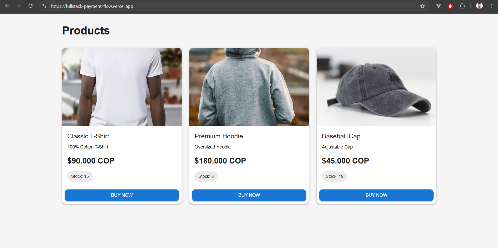
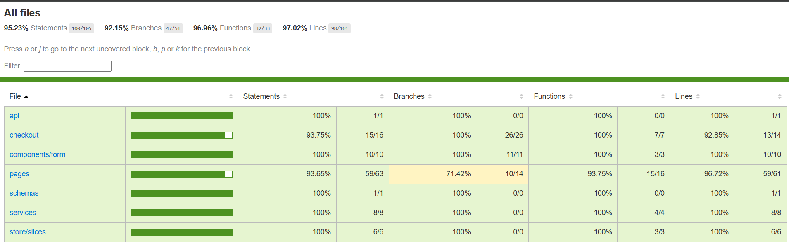
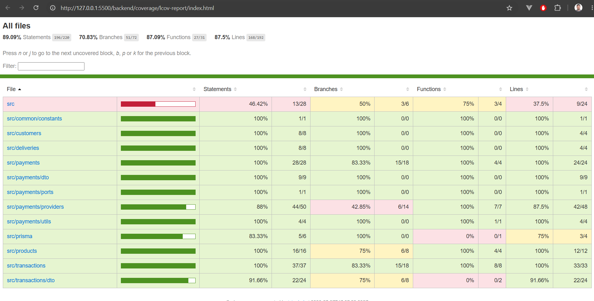

# 💳 Fullstack Payment Flow

A full-stack e-commerce checkout application that simulates a complete payment workflow using a payment gateway sandbox API.

The project consists of a **React frontend** and a **NestJS backend** following a clean architecture approach. Customers can browse products, complete a checkout process, process payments, and automatically update product inventory after successful transactions.

## 📸 Application Preview



---

# ☁️ Cloud Deployment

| Service | Provider |
|----------|----------|
| Frontend | Vercel |
| Backend | Render |
| Database | PostgreSQL (Neon) |
| API Documentation | Swagger |

## Live URLs

- 🌐 **Frontend:** https://fullstack-payment-flow.vercel.app
- ⚙️ **Backend API:** https://fullstack-payment-flow.onrender.com
- 📚 **Swagger:** https://fullstack-payment-flow.onrender.com/api

---

# 🧪 Test Coverage

The project includes unit tests for both frontend and backend.

### Frontend



### Backend



---

# 🚀 Features

- Product catalog
- Product checkout
- Customer information capture
- Delivery information
- Credit card payment processing
- Payment gateway sandbox integration
- Transaction management
- Automatic stock update after successful payments
- Success and Failed payment pages
- Checkout persistence using Local Storage
- Responsive interface
- Form validation with React Hook Form + Zod
- Input sanitization
- Redux Toolkit state management
- REST API documented with Swagger
- Unit testing (Frontend & Backend)
- Cloud deployment (Vercel + Render)

---

# 🛠 Tech Stack

## Frontend

- React 19
- TypeScript
- Vite
- Material UI
- React Router
- Redux Toolkit
- React Hook Form
- Zod
- Axios
- Vitest

## Backend

- NestJS
- TypeScript
- Prisma ORM
- PostgreSQL (Neon)
- Swagger
- Jest
- Payment Sandbox API

### Backend Architecture

The backend follows a **Hexagonal Architecture (Ports & Adapters)**.

```
React
   │
Axios
   │
NestJS Controllers
   │
Services
   │
Ports
   │
Payment Provider (Payment Sandbox)
   │
Prisma ORM
   │
PostgreSQL (Neon)
```

---

# 📂 Project Structure

```text
payment-flow/
│
├── backend/
│   ├── src/
│   └── README.md
│
├── frontend/
│   ├── src/
│   └── README.md
│
├── docs/
│   ├── frontend-coverage.png
│   └── backend-coverage.png
│
└── README.md
```

---

# ⚙️ Getting Started

Clone the repository

```bash
git clone https://github.com/juli6464/fullstack-payment-flow.git
```

---

## Backend

```bash
cd backend
npm install
```

Development

```bash
npm run start:dev
```

---

## Frontend

```bash
cd frontend
npm install
npm run dev
```

---

# 🔄 Checkout Flow

1. Browse available products.
2. Select a product.
3. Complete customer and delivery information.
4. Create a transaction.
5. Process payment through payment Sandbox.
6. Update product stock after successful payment.
7. Display the payment result.

---

# ✅ Implemented

- Product catalog
- Checkout flow
- Payment Sandbox integration
- Transaction management
- Automatic stock management
- Responsive UI
- Form validation
- Input sanitization
- Persistent checkout after browser refresh
- Success and Failed payment pages
- REST API with Swagger documentation
- Unit testing (Frontend & Backend)
- Hexagonal Architecture (Ports & Adapters)

---

# 📚 API Documentation

Swagger UI is available at:

https://fullstack-payment-flow.onrender.com/api

---

# 📖 Additional Documentation

Each application contains its own README with implementation details.

- `backend/README.md`
- `frontend/README.md`